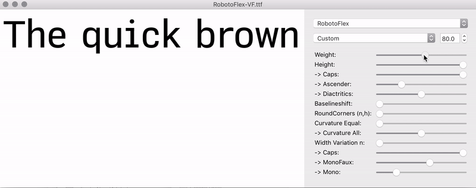
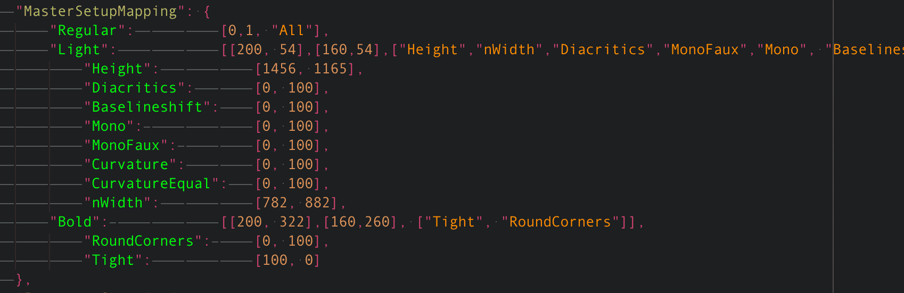
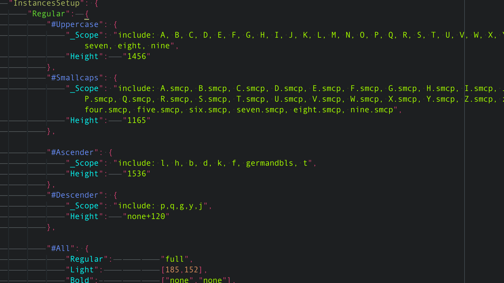

# RobotoFlex
- experiment to test the capabilities of the new variable font-format
- work in progress

Preview in [Fontview](https://github.com/googlei18n/fontview/releases):

### Features currently missing in the font format (for this project)
- per-glyph-interpolation axes (the “Height”-subaxes are currently achieved by a workaround)
- hierachies + math for the slider behaviour to increase usability (e.g. to make the faux-mono-axis a child of the mono-axis, to prevent strange results if both are applied) 
- unrestricted interpolation-value-bounds
- possiblity to add a baseline-shift axis without an aditional master
- possiblity to add a proportional scale axis without an aditional master

.

## Basic Setup / Install
- To handle complex interpolations in Glyphs: [Multipolation](0-install/)
- To preview: [Fontview](https://github.com/googlei18n/fontview/releases) or http://axis-praxis.org

.

## Drawing
### Files
- RobotoFlex.glyphs
- RobotoFlex_multipolation-spec.json (own designspace format)
		
### Multipolation-Space (Design-Space)
**Master-Setup**
- setting up relations and custom scales (also allows different x/y-values)

("MasterName": [origin-value, master-value, ["Children"]])

**Instance-Setup**
- specifying Instances
- set up different values for SmallCaps, ...  (“local interpolations”)

**How to create/update instances in Glyphs**
- Execute the [Multipolation](0-install/) script (Glyphs > Script > Multipolation).

.

## Building Variable Font
Direct export from Glyphs is not yet supported, therefore the following workaround.

### Files
- RobotoFlex.designspace
- build.sh

### Build
1. Export UFOs ()
	- The main Masters can be directly exported as UFOs 
	- “RoundedCorners” and “Tight” needs to be generated from instances and then exported 
	- All “local intepolations” still need to be exported as separate Master-UFOs
2. Manually update the .designspace (sorry for that)
3. Install [Fontmake](https://github.com/googlei18n/fontmake) (if not already installed)
4. execute the build.sh file via Terminal ([instructions](https://apple.stackexchange.com/questions/235128/how-do-i-run-a-sh-or-command-file-in-terminal))
5. Cross fingers and enjoy

If it did not work have a look over here: https://github.com/scribbletone/i-can-variable-font)
